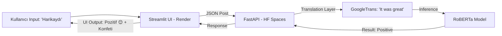
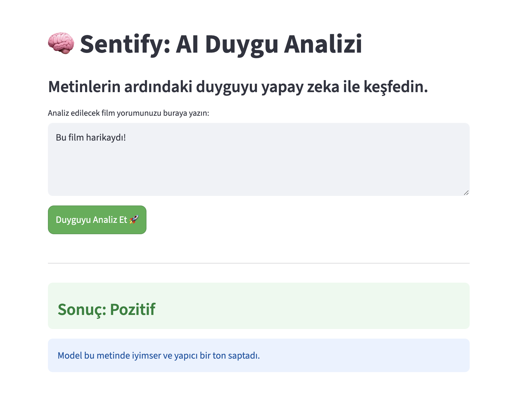
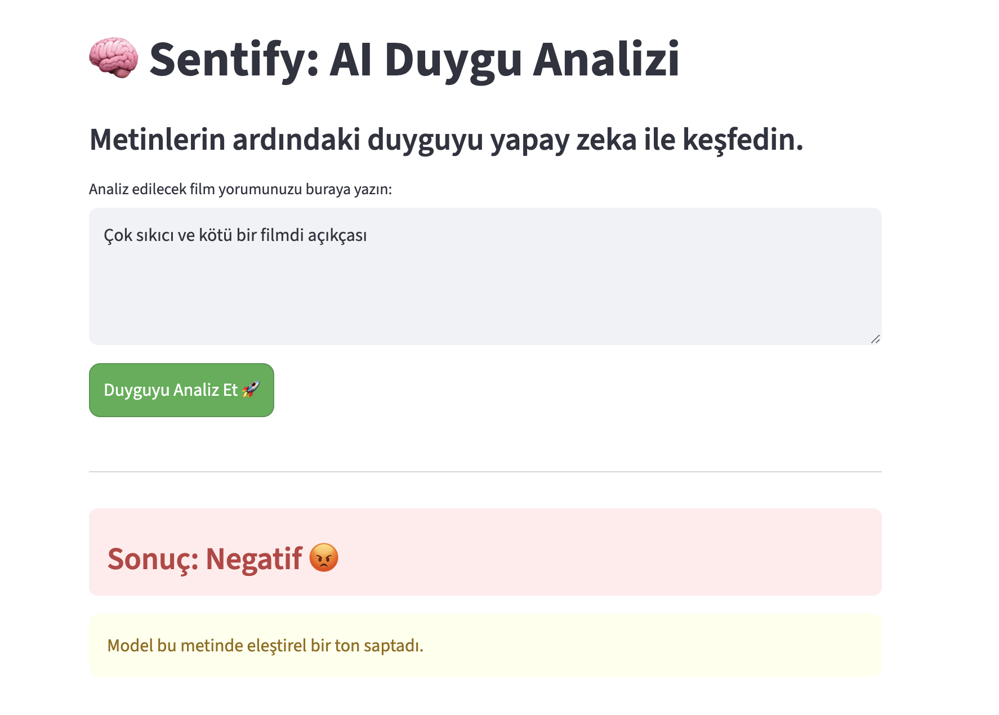
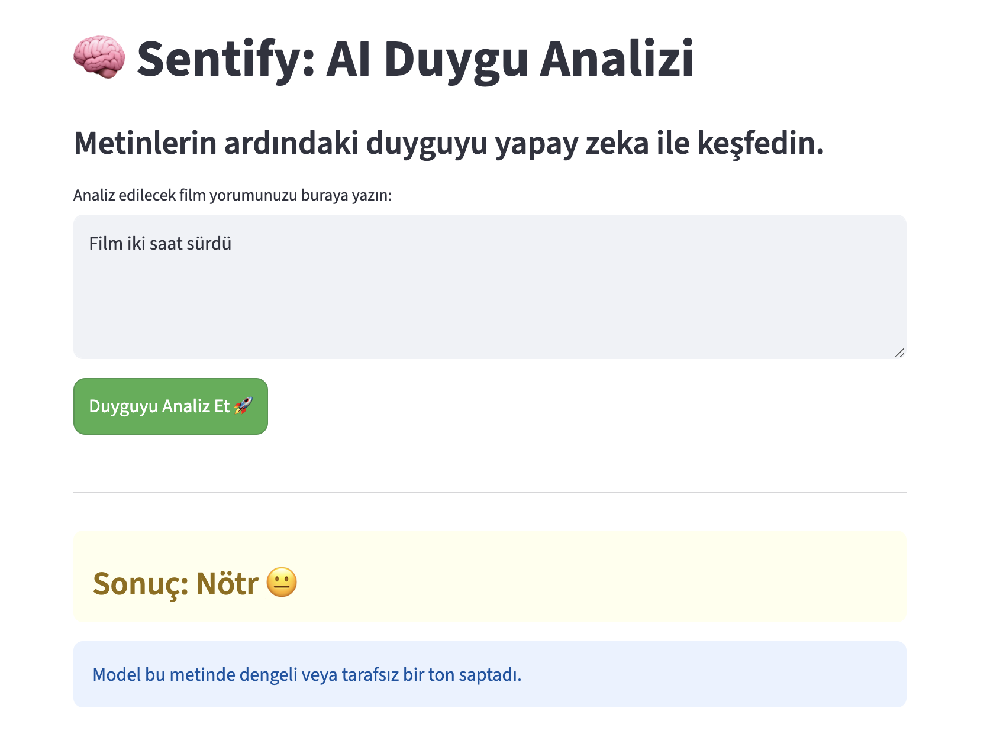

# 🎬 Sentify: Translation-Augmented Sentiment Analysis (RoBERTa)


**Sentify**, film yorumlarının ardındaki duyguyu (Pozitif, Negatif, Nötr) keşfeden, yerel dil kısıtlarını aşmak için çeviri katmanıyla güçlendirilmiş dağıtık bir yapay zeka sistemidir. Geleneksel Makine Öğrenmesi yöntemlerinden modern Transformer mimarilerine uzanan model karşılaştırmalarını ve bu modellerin **Microservice** mimarisiyle canlıya alınmasını kapsar. 

---

## 🚀 Canlı Demo (Live Demo)
Uygulamayı tarayıcınızda test edin:  
👉 **[Sentify: AI Duygu Analizi](https://sentiment-app-3lai.onrender.com/)**

---

## 📌 Proje Genel Bakış 

Bu proje, bir NLP modelinin sadece eğitilmesini değil, gerçek dünya kısıtları (RAM, Dil bariyeri, Sınıf dengesizliği) altında nasıl yüksek performanslı bir ürüne dönüştürüleceğini odak noktasına alır. 

**Öne Çıkan Mühendislik Adımları:**
- **Hybrid Inference:** Türkçe morfolojik karmaşıklığı aşmak için `Translation + RoBERTa` mimarisi.
- **3-Class Sentiment:** Pozitif ve Negatifin yanısıra "Nötr" duyguları da ayırt edebilen `twitter-roberta-base-sentiment` entegrasyonu.
- **Microservice Architecture:** Frontend (Render) ve Backend (Hugging Face) birimlerinin birbirinden bağımsız ölçeklenmesi.
- **Containerization:** Tüm sistemin Dockerize edilerek ortam bağımsız hale getirilmesi.
- **API Optimization:** FastAPI ile asenkron istek yönetimi ve "Lazy Loading" model yükleme stratejisi.
- **Resource Optimization:** Kısıtlı bulut kaynaklarında (512MB RAM) büyük modelleri çalıştırmak için mimari çözümler.

---

## 🧠 Dağıtık Sistem Mimarisi (Architecture)

Proje, yüksek bellek gereksinimi duyan derin öğrenme modellerini optimize etmek amacıyla **Distributed (Dağıtık)** bir yapıda kurgulanmıştır:

1.  **Frontend (UI):** Render üzerinde koşan **Streamlit** uygulaması. Kullanıcı dostu arayüz ve asenkron API istek yönetimi sağlar.
2.  **Backend (API):** Hugging Face Spaces üzerinde **Docker** konteynerında koşan **FastAPI**. 16GB RAM desteği ile BERT modelini saniyeler içinde yükler ve tahmin üretir.
3.  **Model Serving:** Model, API tarafında "Lazy Loading" stratejisiyle yüklenerek sunucu başlangıç hızı optimize edilmiştir.


---

## 📚 Veri Seti

Bu projede, duygu analizi için dünya çapında standart kabul edilen **IMDB Movie Reviews Dataset** kullanılmıştır.

**Veri Seti Özellikleri:**
- 50.000 film yorumu.
- İkili (binary) duygu etiketleri (pozitif / negatif).
- Dengeli dağılım: 25.000 eğitim, 25.000 test örneği.

---

## 📊 Veri Analizi ve Görselleştirme (EDA)

Veri seti üzerinde yapılan ilk incelemeler, modelin öğrenme sürecini optimize etmek için kullanılmıştır.

| Sınıf Dağılımı | Metin Uzunluğu Dağılımı |
| :---: | :---: |
|  |  |

<br>

### Kelime Bulutları (WordClouds)
En sık geçen kelimeler ile pozitif ve negatif kelime bulutları incelenmiştir.

| Positive Word Cloud | Negative Word Cloud |
| :---: | :---: |
|  | ! |


---

## 🧠 Geliştirilen Modeller ve Teknik Detaylar

### A. Baseline: TF-IDF & Logistic Regression
Geleneksel bir yaklaşım olan Lojistik Regresyon ile **%88.74** doğruluk elde edilmiştir.

<br>
<p align="center">
  
</p>

<br>

| En Pozitif Kelimeler | En Negatif Kelimeler |
| :---: | :---: |
|  |  |

### B. Deep Learning: Bi-LSTM & GloVe
Metinlerin ardışık yapısını kavramak için çift yönlü LSTM mimarisi kullanılmıştır. **Stanford GloVe** önceden eğitilmiş kelime vektörleri ile transfer learning uygulanmıştır.

### C. Gelişmiş Mimari: BERT & RoBERTa (State-of-the-Art)
Proje sürecinde iki temel Transformer yaklaşımı uygulanmıştır:
1. **BERT Fine-Tuning:** `bert-base-uncased` modeli IMDB verisiyle %92.4 doğruluk vermiştir.
2. **Translation-Augmented RoBERTa:** Canlı sistemde, yerel dil (Türkçe) desteği ve 3 sınıflı (P/N/Nötr) analiz yeteneği için `cardiffnlp/twitter-roberta-base-sentiment` modeli tercih edilmiştir.

<br>
<p align="center">
  
</p>

<br>

---

## 📈 Model Performans Karşılaştırması

Proje kapsamında eğitilen tüm modellerin başarı oranları aşağıda karşılaştırılmıştır. Modern Transformer mimarilerinin (BERT) klasik ve LSTM tabanlı yöntemlere üstünlüğü net bir şekilde gözlenmektedir.

### Model Başarı Karşılaştırması

| Model | Doğruluk (Accuracy) | Dil Desteği | Duygu Sınıfları |
| :--- | :---: | :---: | :---: |
| Lojistik Regresyon | %88.7 | İngilizce | 2 (P/N) |
| Bi-LSTM (GloVe) | %88.1 | İngilizce | 2 (P/N) |
| BERT (Fine-tuned) | %92.4 | İngilizce | 2 (P/N) |
| **RoBERTa (Hybrid)** | **%90.2+** | **TR / EN** | **3 (P/N/Nötr)** |


<br>
<p align="center">
  
</p>

<br>

---

## 🛠  Kullanılan Teknolojiler

| Kategori | Araçlar |
| :--- | :--- |
| **Dil ve ML** | Python 3.12, PyTorch, Transformers |
| **NLP & Çeviri** | NLTK, Googletrans API |
| **Backend API** | FastAPI, Uvicorn |
| **Frontend UI** | Streamlit |
| **DevOps** | Docker, Docker Compose, Hugging Face Spaces, Render |

---

## 🚀 Deployment

Sistem, iki aşamalı bir mikroservis mimarisiyle ayağa kaldırılmıştır:

1. **Backend (FastAPI):** Model, `/predict` endpoint'i üzerinden JSON tabanlı tahminler sunar. Hugging Face Spaces üzerinde Docker konteynerında koşturulur.
2. **Frontend (Streamlit):** Kullanıcı etkileşimini sağlayan, asenkron yapıda çalışan şık arayüz. Render üzerinde host edilmektedir.


| Pozitif Sonuç | Negatif Sonuç | Nötr Sonuç |
| :---: | :---: | :---: |
|  |  | |
---

## 🛠️ Teknik Zorluklar ve Çözümler 
**1. Bellek Yönetimi (RAM Management):**
Ücretsiz bulut servislerindeki 512MB RAM limiti nedeniyle model yükleme sorunları aşılmak için Backend ve Frontend ayrıştırılmış (Decoupling), model API birimi yüksek RAM sunan HF Spaces'e taşınmıştır.

**2. Dil Bariyeri ve Morfoloji:**
Türkçe'deki karmaşık çekim eklerini (örn: "harikaydı") doğrudan işlemekte zorlanan modeller yerine, metinleri İngilizceye normalize eden bir **Çeviri Katmanı** eklenerek sistemin dilden bağımsız çalışması sağlanmıştır.

**3. 3-Sınıflı Analiz:**
İkili (P/N) modellerin kararsız kaldığı durumları yönetmek için 3 sınıflı `Twitter-RoBERTa` mimarisine geçilerek "Nötr" alanı tanımlanmıştır.

---

## ⚙️ Kurulum ve Çalıştırma

Projeyi yerelinizde Docker ile saniyeler içinde çalıştırabilirsiniz:

1. Depoyu klonlayın:
```bash
git clone [https://github.com/beyzahiz/sentiment-analysis-nlp.git](https://github.com/beyzahiz/sentiment-analysis-nlp.git)
cd sentiment-analysis-nlp
```
2. Docker Compose ile ayağa kaldırın:
```bash
docker-compose up --build
```

## İletişim
Linkedin: [linkedin.com/in/beyzahiz](https://www.linkedin.com/in/beyzahiz/) 
