# 🎬 Movie Sentiment Analysis: From Classical ML to BERT


Bu proje, 50.000 IMDB film yorumu üzerinde duygu analizi gerçekleştirmek amacıyla geliştirilmiştir. Geleneksel Makine Öğrenmesi yöntemlerinden modern Transformer mimarilerine uzanan model karşılaştırmalarını ve bu modellerin **Microservice** mimarisiyle canlıya alınmasını kapsar.

---

## 🚀 Canlı Demo (Live Demo)
Uygulamayı tarayıcınızda test edin:  
👉 **[Sentify: AI Duygu Analizi](https://sentiment-app-3lai.onrender.com/)**

---

## 📌 Proje Genel Bakış 

Bu proje, film yorumları üzerinde **duygu analizi (sentiment analysis)** yapmak için klasik makine öğrenmesi yöntemlerinden modern transformer mimarilerine kadar uzanan farklı yaklaşımları keşfeder. Bir NLP modelinin sadece eğitilmesini değil, gerçek dünya kısıtları (RAM, CPU, Latency) altında nasıl servis edileceğini (Model Serving) odak noktasına alır.

**Öne Çıkan Mühendislik Adımları:**
- **BERT Fine-tuning:** Hugging Face `bert-base-uncased` modeli ile %92.4 doğruluk.
- **Microservice Architecture:** Frontend ve Backend birimlerinin birbirinden bağımsız ölçeklenmesi.
- **Containerization:** Tüm sistemin Dockerize edilerek ortam bağımsız hale getirilmesi.
- **Resource Optimization:** Kısıtlı bulut kaynaklarında (512MB RAM) büyük modelleri çalıştırmak için mimari çözümler.

---

## 🧠 Dağıtık Sistem Mimarisi (Architecture)

Proje, yüksek bellek gereksinimi duyan derin öğrenme modellerini optimize etmek amacıyla **Distributed (Dağıtık)** bir yapıda kurgulanmıştır:

1.  **Frontend (UI):** Render üzerinde koşan **Streamlit** uygulaması. Kullanıcı dostu arayüz ve asenkron API istek yönetimi sağlar.
2.  **Backend (API):** Hugging Face Spaces üzerinde **Docker** konteynerında koşan **FastAPI**. 16GB RAM desteği ile BERT modelini saniyeler içinde yükler ve tahmin üretir.
3.  **Model Serving:** Model, API tarafında "Lazy Loading" stratejisiyle yüklenerek sunucu başlangıç hızı optimize edilmiştir.

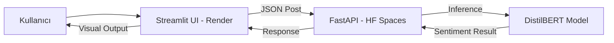
---

## 📚 Veri Seti

Bu projede, duygu analizi için dünya çapında standart kabul edilen **IMDB Movie Reviews Dataset** kullanılmıştır.

**Veri Seti Özellikleri:**
- 50.000 film yorumu.
- İkili (binary) duygu etiketleri (pozitif / negatif).
- Dengeli dağılım: 25.000 eğitim, 25.000 test örneği.

---

## 📊 Veri Analizi ve Görselleştirme (EDA)

Veri seti üzerinde yapılan ilk incelemeler, modelin öğrenme sürecini optimize etmek için kullanılmıştır.

* **Sınıf Dengesi:** 25.000 pozitif ve 25.000 negatif yorum ile tam dengeli bir veri seti üzerinde çalışılmıştır.
* **Kelime Analizi:** Yorumlardaki en sık geçen kelimeler ve metin uzunlukları analiz edilerek modellerin giriş parametreleri belirlenmiştir.

| Sınıf Dağılımı | Metin Uzunluğu Dağılımı |
| :---: | :---: |
| 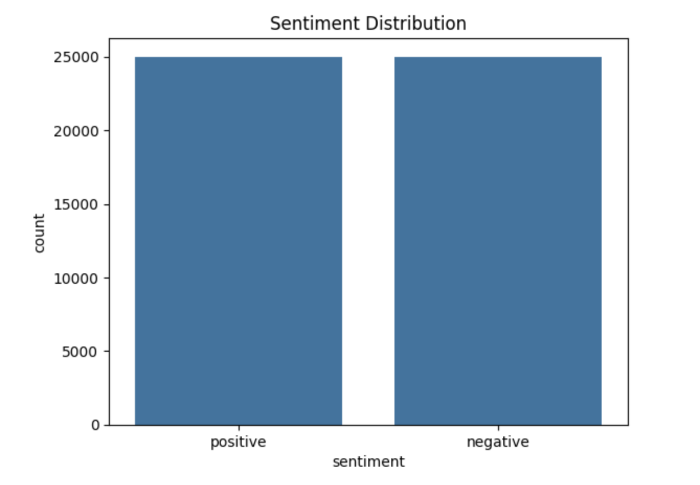 | 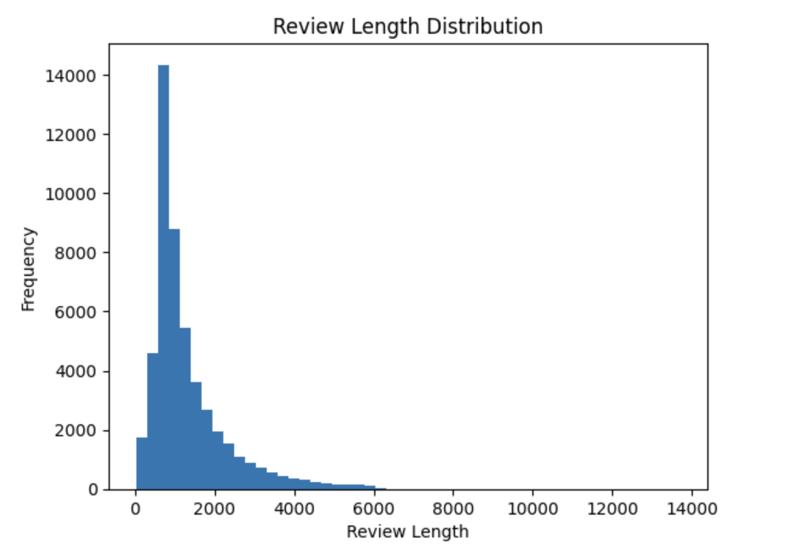 |

<br>

### Kelime Bulutları (WordClouds)
En sık geçen kelimeler ile pozitif ve negatif kelime bulutları incelenmiştir.

<br>
<p align="center">
  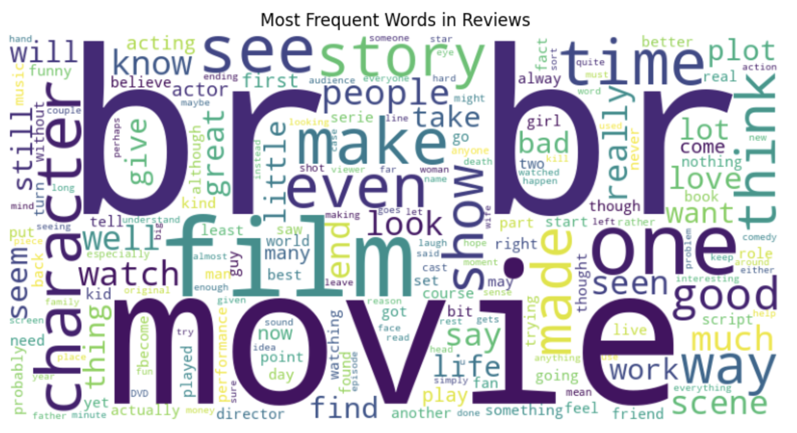
</p>

<br>

| Positive Word Cloud | Negative Word Cloud |
| :---: | :---: |
| 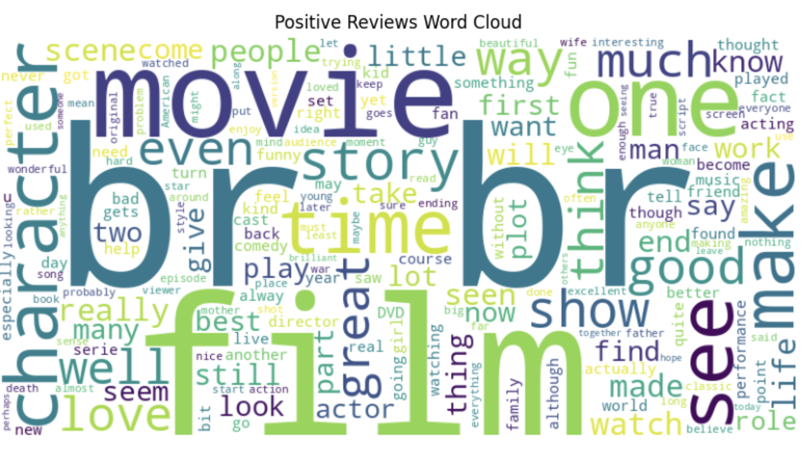 | !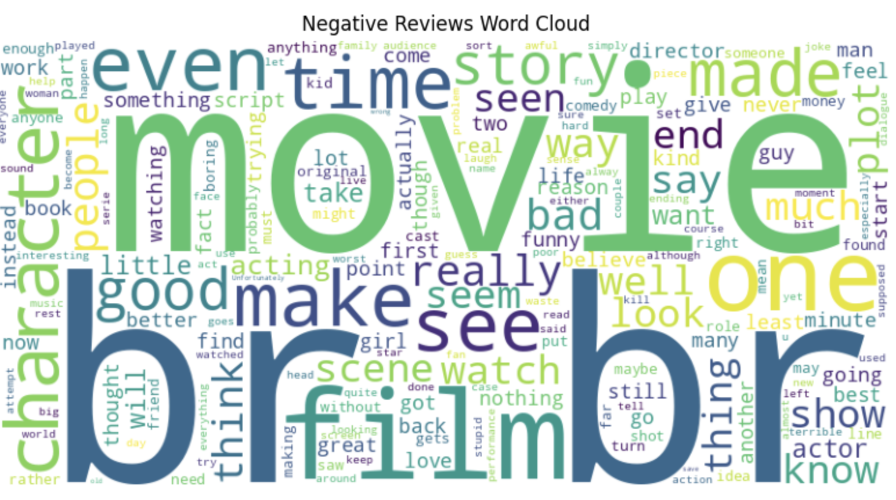 |

---

## 🛠️ Veri Ön İşleme (Preprocessing)

Modellerin başarısını artırmak için ham metin verileri şu aşamalardan geçirilmiştir:
* **Normalization:** Küçük harfe dönüştürme.
* **Cleaning:** Regex ile HTML etiketlerinin (`<br />`) ve noktalama işaretlerinin temizlenmesi.
* **Tokenization:** NLTK kullanılarak kelimelerin ayrıştırılması.
* **Stop-words:** Anlamsal ağırlığı olmayan kelimelerin (the, is, in vb.) elenmesi.

---

## 🧠 Geliştirilen Modeller ve Teknik Detaylar

### A. Baseline: TF-IDF & Logistic Regression
Geleneksel bir yaklaşım olan Lojistik Regresyon ile **%88.74** doğruluk elde edilmiştir. Modelin kararlarını hangi kelimelere dayanarak verdiği katsayı analizleri ile görselleştirilmiştir.

<br>
<p align="center">
  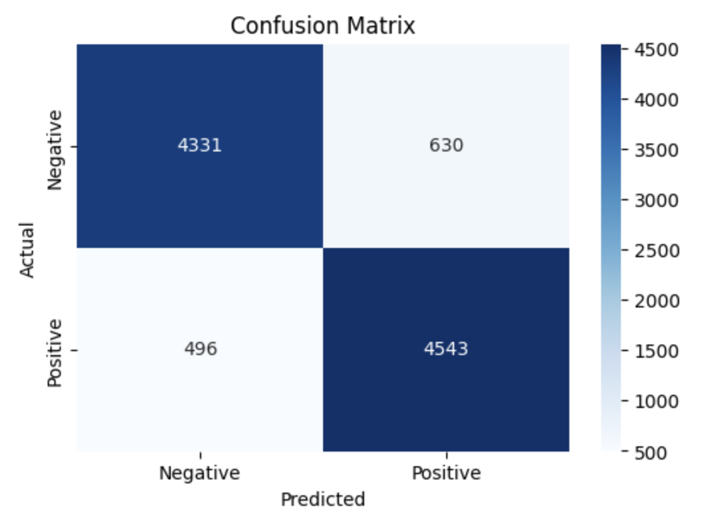
</p>

<br>

| En Pozitif Kelimeler | En Negatif Kelimeler |
| :---: | :---: |
| 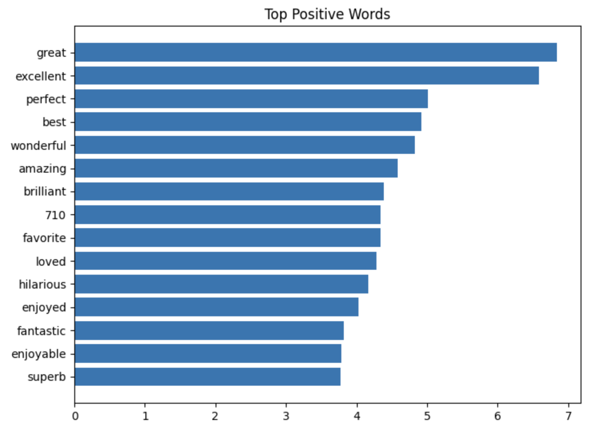 | 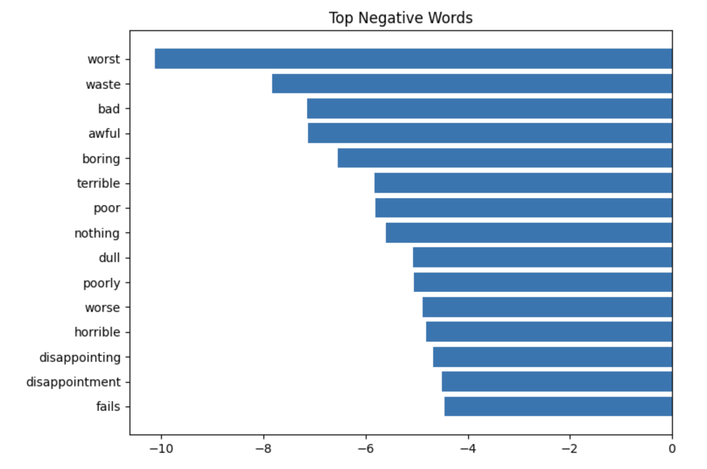 |

### B. Deep Learning: Bi-LSTM & GloVe
Metinlerin ardışık yapısını kavramak için çift yönlü LSTM mimarisi kullanılmıştır. **Stanford GloVe** önceden eğitilmiş kelime vektörleri ile transfer learning uygulanmıştır.

### C. State-of-the-Art: BERT Fine-Tuning
Hugging Face `Transformers` kütüphanesi kullanılarak `bert-base-uncased` modeli bu veri setine özel olarak eğitilmiştir.
* **Optimizer:** AdamW
* **Learning Rate:** 2e-5
* **Başarı:** **%92+ Accuracy** ile en iyi performansı göstermiştir.

<br>
<p align="center">
  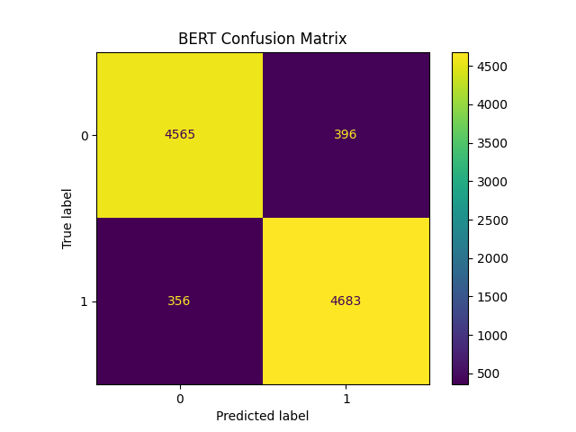
</p>

<br>

---

## 📈 Model Performans Karşılaştırması

Proje kapsamında eğitilen tüm modellerin başarı oranları aşağıda karşılaştırılmıştır. Modern Transformer mimarilerinin (BERT) klasik ve LSTM tabanlı yöntemlere üstünlüğü net bir şekilde gözlenmektedir.

### Model Başarı Karşılaştırması

| Model | Doğruluk (Accuracy) |
| :--- | :---: |
| Lojistik Regresyon + TF-IDF | 0.887 |
| Bi-LSTM (GloVe) | 0.881 |
| **BERT (Fine-tuned)** | **0.924** |


<br>
<p align="center">
  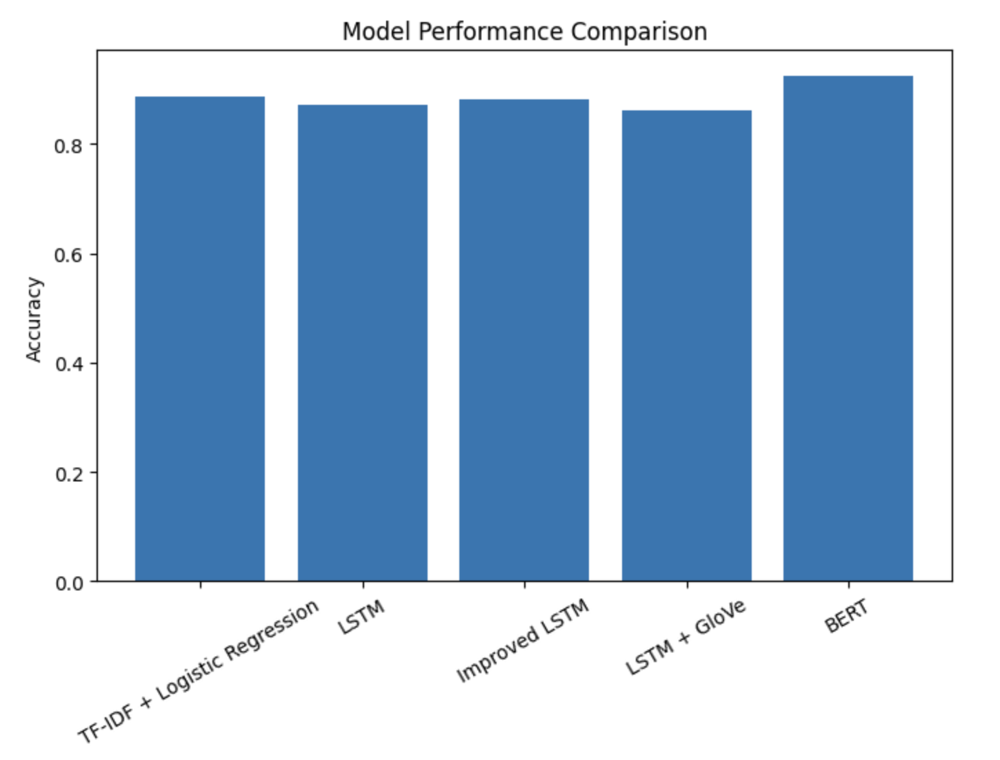
</p>

<br>

---

## 🛠  Kullanılan Teknolojiler

| Kategori | Araçlar |
| :--- | :--- |
| **Dil ve Temel Kütüphaneler** | Python, Pandas, NumPy |
| **NLP** | NLTK, spaCy |
| **Makine Öğrenmesi** | Scikit-learn |
| **Derin Öğrenme** | TensorFlow / Keras, PyTorch |
| **Transformers** | Hugging Face Transformers (`bert-base-uncased`) |
| **Deployment** | FastAPI, Streamlit |

---

## 🚀 Deployment

Eğitilen BERT modeli, gerçek zamanlı tahminler yapabilmek için iki aşamalı bir mimari ile ayağa kaldırılmıştır. Model, Streamlit arayüzü üzerinden yazılan film yorumlarını gerçek zamanlı olarak analiz edebilmektedir.

1.  **Backend (FastAPI):** Model, `/predict` endpoint'i üzerinden JSON tabanlı tahminler sunan yüksek performanslı bir API haline getirilmiştir.
2.  **Frontend (Streamlit):** Kullanıcının yorum yazıp anlık duygu durumunu görebildiği sade ve şık bir arayüz geliştirilmiştir.


| Pozitif Deneme | Negatif Deneme |
| :---: | :---: |
| 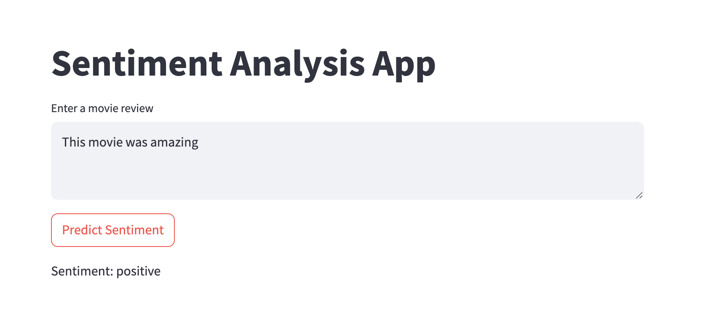 | 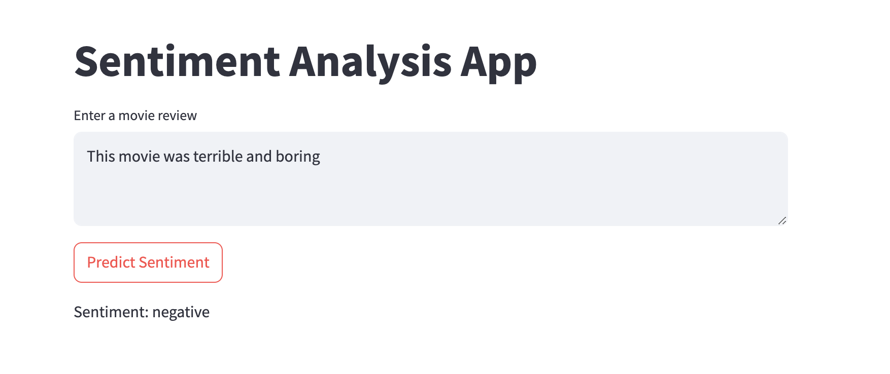 |

---

## ⚙️ Kurulum ve Çalıştırma

Projeyi yerelinizde çalıştırmak için:

1. Depoyu klonlayın:
```bash
git clone [https://github.com/beyzahiz/sentiment-analysis-nlp.git](https://github.com/beyzahiz/sentiment-analysis-nlp.git)
cd sentiment-analysis-nlp
```
2. Gereksinimleri yükleyin:
```bash
pip install -r requirements.txt
```
3. FastAPI sunucusunu başlatın:
```bash
cd api
uvicorn app:app --reload
```
4. Streamlit uygulamasını çalıştırın:
```bash
streamlit run streamlit_app.py
```
5. Tarayıcıda açın:
```bash
http://localhost:8501
```

---

## 🛠️ Teknik Zorluklar ve Çözümler (Engineering Insights)
**Bellek Yönetimi (RAM Management):** Ücretsiz bulut servislerindeki 512MB RAM limiti, 1.2GB'lık standart BERT modelleri için yetersiz kalmıştır.

**Çözüm:** Model, distilbert-base-uncased-finetuned-sst-2-english (DistilBERT) versiyonuna optimize edilmiş ve ağırlıklar low_cpu_mem_usage parametresiyle yüklenmiştir. Backend ünitesi, yüksek kapasiteli RAM sunan Hugging Face Spaces'e taşınarak sistem stabilitesi sağlanmıştır.

